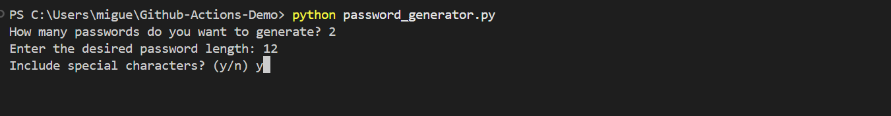
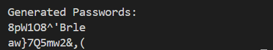

# Github Actions Demo
This repository demonstrates the use of GitHub's action workflows. I created a password generator script written in Python and its unit test.
Next, I used a pre-built Github actions workflow for a Python application, which was modified for this project.
Link to the TechWorld with Nana YouTube channel video about Github Action: https://www.youtube.com/watch?v=R8_veQiYBjI

## Prerequisites
Have Python 3 installed on your computer

## ⚙️ Technologies used in this project
Github Actions 
Python
Python testing framework

## How It Works

### Password generation Python Script
The application generates the number of passwords indicated on the terminal, with the length indicated on the terminal, and including or excluding special characters.


Once the script is executed, the output will be like the following


## Run the Script

### Option 1: Run from Terminal
1. Open the project directory in your terminal.
2. Run the script with:
   ```bash
   python3 password_generator.py
   ```

### Option 2: Run with PyCharm
1. Open the project folder in PyCharm.
2. Right-click `password_generator.py` and select **Run 'password_generator'**.

### Option 3: Run with Visual Studio Code
1. Open the project folder
2. Locate password_generator.py
3. Right-click the file and choose Run Python File in Terminal

### Github Actions workflow
After committing to the repository, the GitHub Actions workflow is activated. The GitHub Actions workflow is executed on an Ubuntu machine where Python version 3.10 is installed. It installs the dependencies for code quality assurance of the password generator Python script and for running its unit tests. Once the code quality assurance and unit test dependencies are installed, the code quality assurance of the password generator Python script is run, followed by the execution of its unit tests. The entire process is automated.


